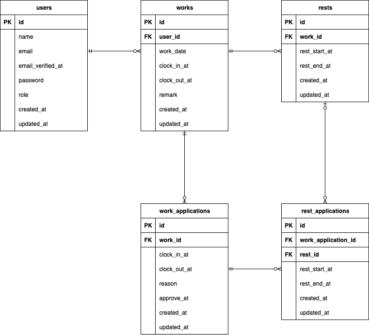

# clockin

## 環境構築

### Docker ビルド

1. git clone git@github.com:chatainazara/clockin.git
2. DockerDesktop アプリを立ち上げる
3. docker-compose up -d --build

### Laravel 環境構築

1. docker-compose exec php bash

2. composer install

3. cp .env.example .env

4. .env に以下の環境変数を追加または変更  
   DB_CONNECTION=mysql  
   DB_HOST=mysql  
   DB_PORT=3306  
   DB_DATABASE=laravel_db  
   DB_USERNAME=laravel_user  
   DB_PASSWORD=laravel_pass

MAIL_MAILER=smtp  
MAIL_HOST=mailhog  
MAIL_PORT=1025  
MAIL_USERNAME=null  
MAIL_PASSWORD=null  
MAIL_ENCRYPTION=null  
MAIL_FROM_ADDRESS="noreply@example.com"  
MAIL_FROM_NAME="${APP_NAME}"

5. アプリケーションキーの作成
   php artisan key:generate

6. マイグレーションの実行
   php artisan migrate

7. シーディングの実行
   php artisan db:seed  
   (role:admin email:admin@sakamaki-forest.com password:adminadmin に設定しています)

### テストの実行

1. Mysql コンテナに入る
   docker-compose exec mysql bash

2. MySQL コンテナ上
   $ mysql -u root -p
   パスワードを聞かれたら root

3. テスト用データベースを作成
   CREATE DATABASE demo_test;

4. php コンテナで本アプリのテストを一度に実行
   vendor/bin/phpunit tests/Feature

## 使用技術(実行環境)

1. PHP: 8.1.33
2. Laravel: 8.83.29
3. MySQL: 8.0.26
4. nginx: 1.21.1
5. mailhog: 1.0.1

## ER 図

## URL

### 開発環境

1. phpMyAdmin: http://localhost:8080
2. ユーザー登録画面: http://localhost/register
3. ホーム画面: http://localhost/
4. MailHog: http://localhost:8025
